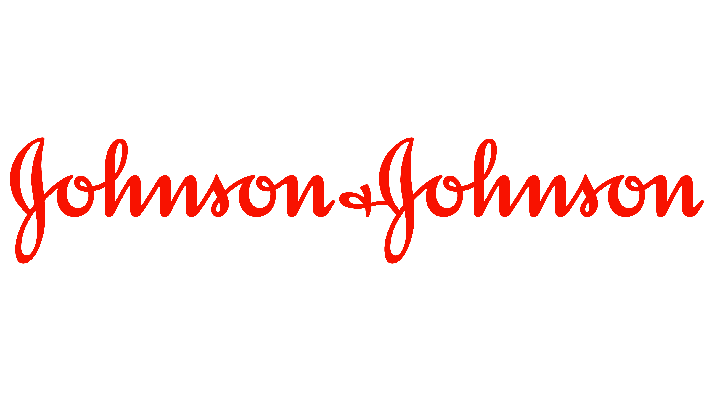

# JNJ Capstone Project
 

#### Problem Statement/ Business Need: 

The GxP regulatory environment is very complex as different countries have their own regulations, and standardization is very limited. GxP regulations and guidance documents are thousands of pages of text files (pdf or HTML) posted in several internet locations. These regulatory requirements have to be manually parsed, analyzed, and classified to develop the J&J quality requirements. This is a time-consuming process.

#### Project Outcome / Solution:

- With fine-tuned GPT-3 model, classify requirements by quality topics and classify quality topics requirements into themes; summarize theme requirements into a J&J Quality requirement that meets all the regulations and guidance documents.
- Build metrics to evaluate the model and benmark using other available large language models as well as traditional machine learning models.

#### Authors:  
Vishweshwar Tyagi (captain), Daoxing Zhang, Siqi He, Siwen Xie, Yihao Gao

#### Sponsor/Mentor: 
Frank Janssens, Majd Mustapha

#### Instructor: 
Adam Kelleher

#### CA: 
Xuanyu Li